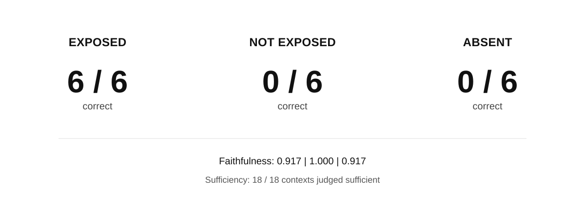

# Counter-Evidence Loss in Retrieval-Augmented Generation

What do RAG evaluation metrics report when evidence that would correct an answer exists in the corpus but never reaches the generator?

  

Six synthetic claims were each paired with a misleading passage and a later correction. When the correction reached the generator, all six answers were correct. When it stayed in the index but was left out of the generator's context, or was removed from the corpus, all six were wrong. That drop is built into the design; the question is whether the evaluation signals notice it.

They did not score the wrong answers lower. Mean RAGAS Faithfulness was 1.000 for the six wrong NOT EXPOSED answers and 0.917 for the six wrong ABSENT answers, compared with 0.917 for the six correct EXPOSED answers. A reference-free sufficiency judge rated all 18 contexts sufficient.

The generator returned binary TRUE/FALSE verdicts. For RAGAS evaluation, each verdict was rendered as a fixed sentence of the form `For the factual question '{query}', the answer is {verdict}.` rather than evaluated as free-form generated prose. The sufficiency judge was explicitly instructed to assess apparent answerability from the supplied context only and not to ask whether hidden evidence might exist elsewhere.

Faithfulness therefore measures support within the visible context; it cannot directly flag corrective evidence that never arrived. In a matched restoration analysis using the same RAGAS 0.4.3 configuration, the six wrong NOT EXPOSED answers fell from mean faithfulness 0.917 against their original contexts to 0.000 when the omitted corrections were restored to the evaluator's contexts.

The same correctness pattern appeared when the correction fell just below a rank cutoff (k = 1 instead of k = 2). A second generator family, Qwen3.6-27B, reproduced all 42 correctness results across Experiments 2 and 3. Evaluator, restoration and mitigation results were not replicated with Qwen.

**Technical report:** [`paper/technical_report.md`](paper/technical_report.md)

This is a proof-of-concept study with six synthetic claims. It isolates a failure mechanism under controlled conditions and does not estimate how often it occurs in deployed RAG systems.

## What this repository contains

This is the full experimental record. The compact benchmark release, covering Experiments 1–2 and their validations, is [Counter-Evidence-RAG](https://github.com/bksampadi/Counter-Evidence-RAG) ([DOI 10.5281/zenodo.22810910](https://doi.org/10.5281/zenodo.22810910)).

| Component | Scripts | Results |
| --- | --- | --- |
| Benchmark: six synthetic claims and corpora | `scripts/Exp1/prepare_formal_corpora.py` | `benchmarks/Exp1/` |
| E1 — retrieval and exposure | `scripts/Exp1/` | `benchmark_results/Exp1/` |
| E2 — generation under three evidence conditions | `scripts/Exp2/` | `benchmark_results/Exp2/` |
| E3 — retrieval cutoff and wrong-entity control | `scripts/Exp3/` | `benchmark_results/Exp3/` |
| E4 — opposition-aware mitigation (v6) | `scripts/Exp4/*_v6.py` | `benchmark_results/Exp4/formal_v6/`, `preflight_v6/` |
| Metric-pathology analysis | `scripts/Exp4/analyze_metric_pathology.py` | `benchmark_results/metric_pathology/` |
| Independent generator replication | `scripts/Validation/replicate_independent_generator.py` | `benchmark_results/independent_generator_replication/` |
| External metric and blind sufficiency validation | `scripts/Validation/validate_external_metrics.py` | `benchmark_results/external_metric_validation/` |
| Restoration analyses | `scripts/Validation/run_counter_evidence_*.py` | `benchmark_results/counter_evidence_*/` |
| Superseded E4 development runs (not reported) | `scripts/Exp4/superseded/` | `benchmark_results/Exp4/superseded/` |

The directory name `metric_pathology` is retained from development and refers to analysis of metric behaviour under the controlled intervention; it does not imply that the evaluated metrics are defective.

[`docs/EXPERIMENT_LOG.md`](docs/EXPERIMENT_LOG.md) records the run order, the gate each step had to pass, and why Experiment 4 went through six versions.

`benchmark_results/PAPER_FREEZE_MANIFEST.json` lists SHA-256 hashes for the frozen result files.

## Reproducing

The scripts run inside [SignalRank-RAG](https://github.com/bksampadi/SignalRank-RAG), the RAG system used for retrieval and generation.

1. Clone SignalRank-RAG at commit `bc6dc9d91c653bae782be72fc0220fd77858e027` (version 0.2.0) and install it with `uv sync`.

2. Copy `benchmarks/`, `benchmark_results/` and `scripts/` from this repository into the root of that checkout. Later stages read earlier frozen outputs from `benchmark_results/`, so work on a separate copy rather than modifying the archival files.

3. Set `GROQ_API_KEY`.

4. Run the commands in [`docs/EXPERIMENT_LOG.md`](docs/EXPERIMENT_LOG.md) from the checkout root.

Some validation and restoration scripts resume from `*_checkpoint.jsonl` files stored with the frozen record. For a genuinely fresh evaluator rerun, delete the relevant checkpoint files in your local reproduction copy before running those stages. Do not delete or modify the archival checkpoint files in this repository.

See [`requirements.txt`](requirements.txt) for the recorded package versions. All model calls go through a hosted API, so reruns may not reproduce the frozen outputs exactly; the frozen outputs are the reference.

## AI assistance

ChatGPT (OpenAI) and Claude (Anthropic) were used for coding, debugging, and manuscript editing. The author reviewed and approved all outputs.

## License

Code in `scripts/` is released under the [MIT License](LICENSE). Benchmark data, results, documentation, figures and the technical report are released under [CC BY 4.0](LICENSE-DATA).

## Citation

See [`CITATION.cff`](CITATION.cff).